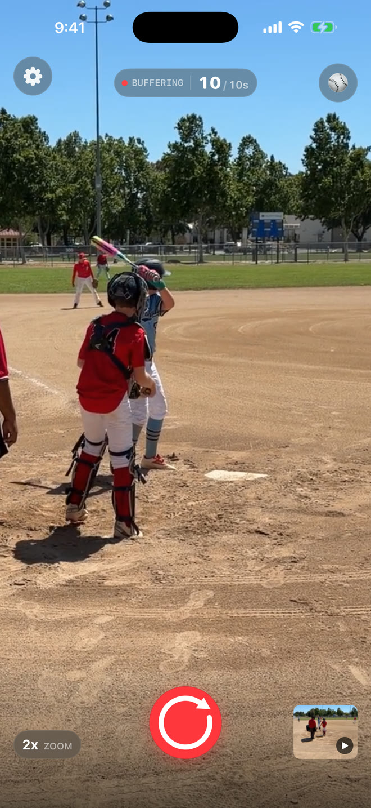
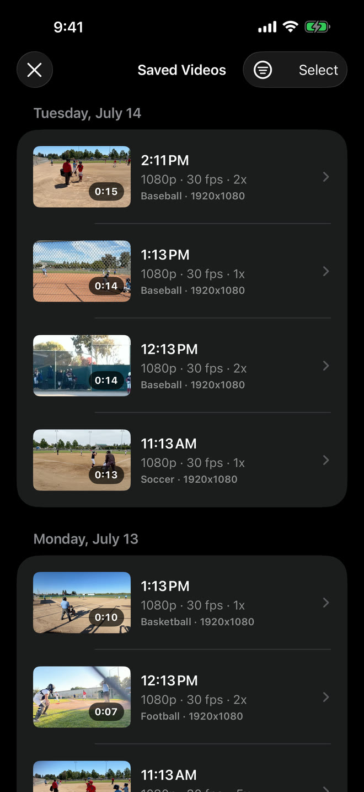

  

# Sideline Save

## About Sideline Save

### Tap when it matters. Save the whole highlight.

Sideline Save is an iPhone camera app for parents, families, and sideline
supporters who want the big moment without recording the whole game.

[About](https://chase-seibert.github.io/sideline-save-community/) ·
[Waitlist](https://docs.google.com/forms/d/e/1FAIpQLScZcynubUWDhJu5gBwgFu-eE2r5PIz1a63V5BcG1F11n85OKg/viewform?usp=publish-editor) ·
[Support](https://chase-seibert.github.io/sideline-save-community/support.html) ·
[Privacy](https://chase-seibert.github.io/sideline-save-community/privacy-policy.html) ·
[Gimbals](https://chase-seibert.github.io/sideline-save-community/recommended-gimbals.html)

## One moment, three steps

1. **Keep the camera ready.** Sideline Save holds a short rolling buffer while
   the app is open.
2. **Tap when the play breaks open.** Your clip starts with the seconds from
   before you tapped.
3. **Tap again to save.** The finished highlight goes directly to your Photos
   library.

## Sideline Save at a glance

- **5, 10, or 20 seconds:** Choose how much action from before the first tap
  should be included.
- **Five sport presets:** Baseball, Basketball, Soccer, Football, and Custom
  remember their own setup.
- **Photos first:** Highlights are saved locally to Photos and organized into
  sport albums when possible.

## Why it exists

### The best plays rarely give you a warning

It is easy to spend a whole game recording every pitch, shot, serve, or drive
just in case something happens. Later, the real highlights are buried inside a
camera roll full of misses and almosts.

Sideline Save flips that routine around. Keep the camera pointed at the action
and watch the game. When a play becomes worth keeping, start the clip
then—Sideline Save can still include the lead-in. You save fewer videos, keep
more of the context that matters, and spend less time cleaning up afterward.

## See the whole highlight workflow

  
  
  
  

Keep the camera ready, review highlights organized by day, open the complete
15-second saved clip, and tune reliable capture settings for each sport.

## Made for a real sideline

Fast controls, flexible capture choices, and a library built around the way
families find and share highlights.

### Ready for fast action

Camera-style zoom controls, pinch-to-zoom, supported video stabilization, and
quality and frame-rate options help you frame each sport.

### Organized by sport

Each sport remembers its own capture settings. Saved clips can be reassigned
later and moved to the matching sport album.

### Easy to find and share

Open Saved Videos from the home screen to filter, play, favorite, share,
delete, or change the sport for a highlight.

### A brief safety net

If you miss the first tap, a recent available buffer may still be recoverable
from Settings for about five minutes.

## Your highlights stay yours

Video and audio remain on your iPhone and in your Photos library. Sideline Save
has no accounts, ads, or cross-app tracking, and collects only limited app-usage
information to improve the product.

[Read the Privacy Policy](https://chase-seibert.github.io/sideline-save-community/privacy-policy.html)

## Independent and personal

### Built by Chase Seibert

Sideline Save is developed for iPhone with a simple goal: make it easier for
families to catch the moments they will want to replay. Questions, ideas, and
honest feedback are welcome.

[Visit Sideline Save Support](https://chase-seibert.github.io/sideline-save-community/support.html)

© 2026 Chase Seibert. Sideline Save.
