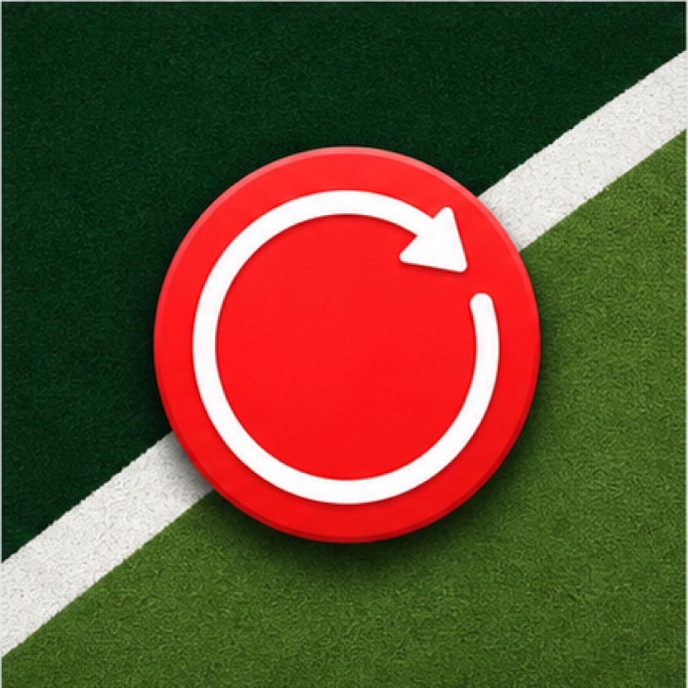
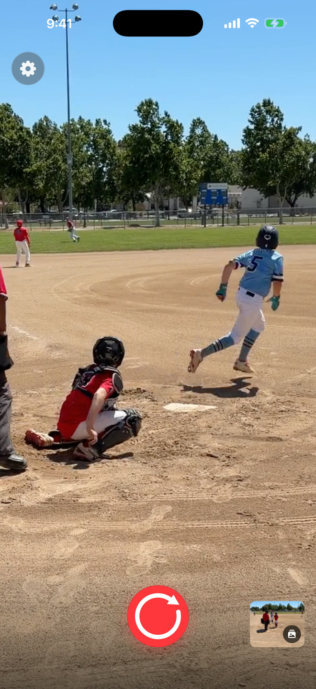
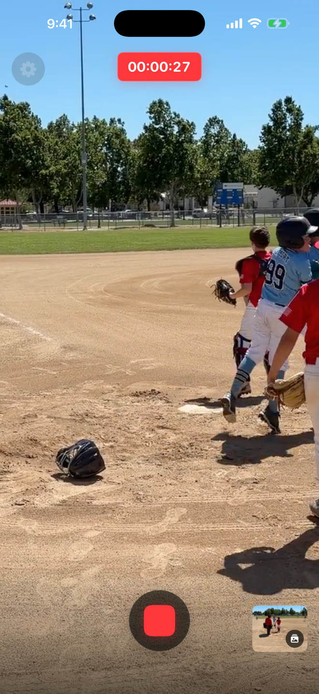
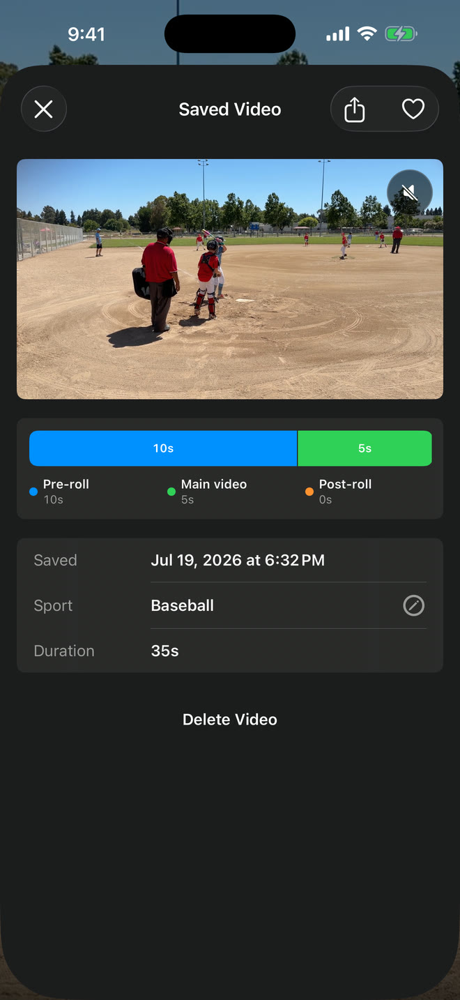
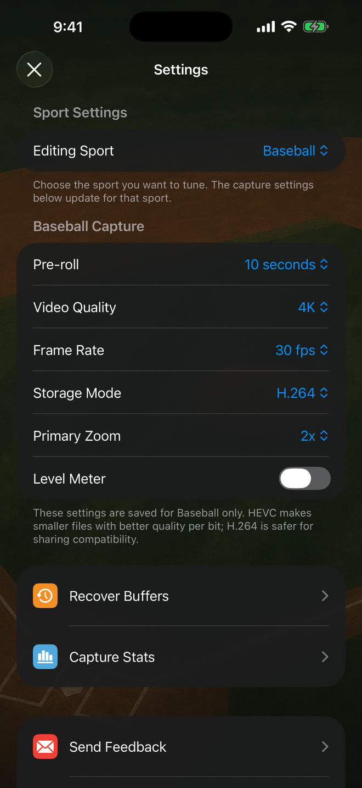

  

# Sideline Save

## Youth sports video for parents

### Stop recording every play just in case.

When a play becomes worth saving, press record. Your video will still have the
beginning of the play—without recording the whole game.

[Get early access on iPhone](https://docs.google.com/forms/d/e/1FAIpQLScZcynubUWDhJu5gBwgFu-eE2r5PIz1a63V5BcG1F11n85OKg/viewform?usp=publish-editor)

Most parents get their TestFlight invite within five minutes.

[About](https://chase-seibert.github.io/sideline-save-community/) ·
[Blog](https://chase-seibert.github.io/sideline-save-community/blog/) ·
[Baseball + Softball](https://chase-seibert.github.io/sideline-save-community/baseball-softball.html) ·
[Soccer](https://chase-seibert.github.io/sideline-save-community/soccer.html) ·
[Support](https://chase-seibert.github.io/sideline-save-community/support.html) ·
[Privacy](https://chase-seibert.github.io/sideline-save-community/privacy-policy.html) ·
[Equipment](https://chase-seibert.github.io/sideline-save-community/recommended-gimbals.html)

## One moment, three steps

1. **Keep the camera ready.** Sideline Save holds a short rolling buffer while
   the app is open.
2. **Press record when the play gets good.** Your video will still have the
   beginning of the play.
3. **Press stop when it ends.** The finished video goes directly to your Photos
   library.

## Sideline Save at a glance

- **Five sport presets:** Baseball, Basketball, Soccer, Football, and Custom
  remember their own setup.
- **Albums for every sport:** Saved videos go to Photos and are organized into
  matching sport albums when possible.
- **Your highlights stay yours:** Videos stay on your iPhone and in your Photos
  library until you choose to share them.

## Why it exists

### The best plays rarely give you a warning

It is easy to spend a whole game recording every pitch, shot, serve, or drive
just in case something happens. Later, the real highlights are buried inside a
camera roll full of misses and almosts.

Sideline Save flips that routine around. Keep the camera pointed at the action
and watch the game. When a play becomes worth keeping, press record then—your
video can still include the beginning of the play. You save fewer videos, keep
more of the context that matters, and spend less time cleaning up afterward.

## Made for your game

### Baseball & Softball

Press record after the hit. Your video will still have the pitch and the swing.

[See Sideline Save for baseball and softball](https://chase-seibert.github.io/sideline-save-community/baseball-softball.html)

### Soccer

Press record when the play heads toward goal. Your video will still have the
pass that started it.

[See Sideline Save for soccer](https://chase-seibert.github.io/sideline-save-community/soccer.html)

## Here’s how it works

  
  
  
  

Press record after the play gets good, stop when it is over, and keep the
beginning in the finished video. The final screen shows the reliable settings
saved for each sport.

## Optimized for the big moment

Fast controls, flexible capture choices, and a library built around the way
families find and share highlights.

### Ready for fast action

Camera-style zoom controls, pinch-to-zoom, supported video stabilization, and
quality and frame-rate options help you frame each sport.

### Organized by sport

Each sport remembers its own capture settings. Saved videos can be reassigned
later and moved to the matching sport album.

### Easy to find and share

Open Saved Videos from the home screen to filter, play, favorite, share,
delete, or change the sport for a highlight.

### Save space on your phone

Short highlight clips take up far less space than long recordings of the whole
game.

## Your highlights stay yours

Video and audio remain on your iPhone and in your Photos library. Sideline Save
has no accounts, ads, or cross-app tracking, and collects only limited app and
website usage information to improve the product.

[Read the Privacy Policy](https://chase-seibert.github.io/sideline-save-community/privacy-policy.html)

## Independent and personal

### Built by Chase Seibert

Sideline Save is developed for iPhone with a simple goal: make it easier for
families to catch the moments they will want to replay. Questions, ideas, and
honest feedback are welcome.

[Visit Sideline Save Support](https://chase-seibert.github.io/sideline-save-community/support.html)

© 2026 Chase Seibert. Sideline Save.
