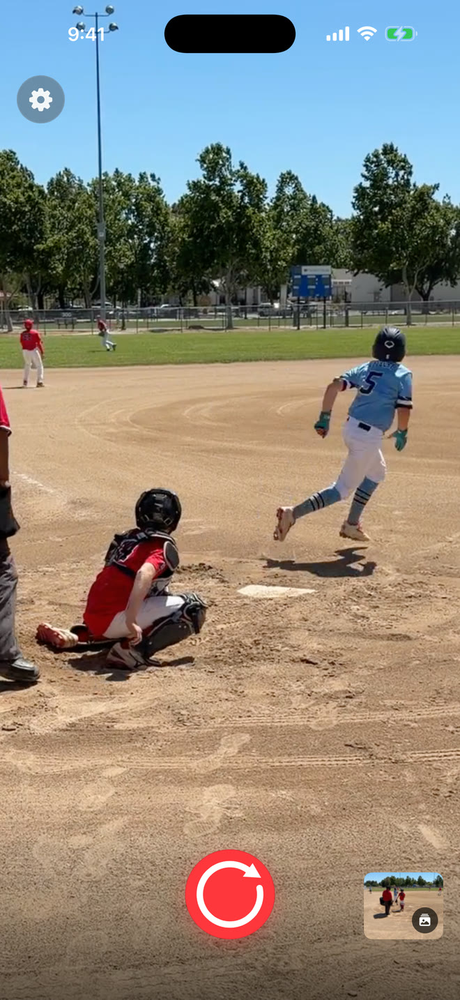
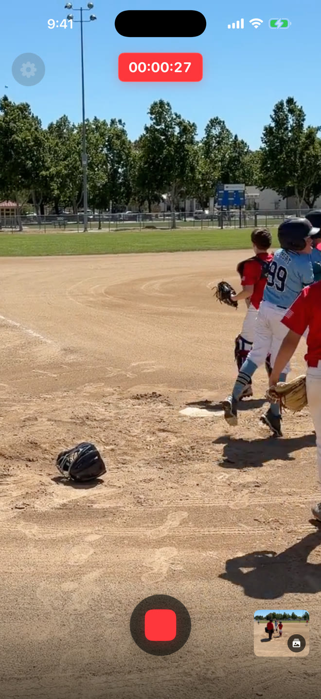

  

# Sideline Save

## iPhone sports camera for parents

### Record after the play.

Sideline Save is a camera app for youth sports. It keeps the recent action
ready, so you can hit Record at any time, continue recording as normal, then
tap again to stop and save.

[Download free for iPhone](https://apps.apple.com/us/app/sideline-save/id6790879656)

Free to try with 15 saved videos · iPhone, iOS 17+ · No account or ads

[About](https://sidelinesave.com/) ·
[Baseball + Softball](https://sidelinesave.com/baseball-softball.html) ·
[Soccer](https://sidelinesave.com/soccer.html) ·
[Support](https://sidelinesave.com/support.html) ·
[Blog](https://sidelinesave.com/blog/) ·
[Equipment](https://sidelinesave.com/recommended-gimbals.html) ·
[Privacy](https://sidelinesave.com/privacy-policy.html)

## How it works

1. **Always be shooting.** Keep the camera pointed at the play. Sideline Save
   keeps the recent action ready.
2. **Hit the record button.** At any time, you can hit the record button, even
   after the play has happened.
3. **Continue recording as normal.** Tap the same button again to stop and save.

## Tap to record. Tap again to stop.

Your video captures more on each end, helping make sure you do not miss the
moment.

  
  
  

## Why it exists

### Most plays are ordinary—until one isn’t

With the regular Camera app, you either record everything or react after the
beginning is gone. Sideline Save lets you decide after the action starts and
still keep the lead-in.

That means fewer misses in Photos, less cleanup later, and more attention on the
game.

## Made for your game

### Baseball & Softball

Press record after the hit. Your video will still have the pitch and the swing.

[See Sideline Save for baseball and softball](https://sidelinesave.com/baseball-softball.html)

### Soccer

Press record when the play heads toward goal. Your video will still have the
pass that started it.

[See Sideline Save for soccer](https://sidelinesave.com/soccer.html)

## Your footage never goes to a Sideline Save cloud

While Sideline Save is open, recent action is held temporarily on your iPhone so
it can be added to a highlight. Lock your phone, switch apps, or close Sideline
Save and camera capture stops. Finished clips go to Photos. There are no
accounts, ads, or cross-app tracking.

[Read the Privacy Policy](https://sidelinesave.com/privacy-policy.html)

## Independent and personal

### Built by a baseball dad with the same problem

I built Sideline Save after getting tired of recording pitch after pitch at my
son’s games, deleting nearly all of them, and still worrying that the next pitch
would be the one I missed.

[Read why I built Sideline Save](https://sidelinesave.com/blog/why-i-built-a-camera-app-for-youth-sports-parents.html)

© 2026 Chase Seibert. Sideline Save.
