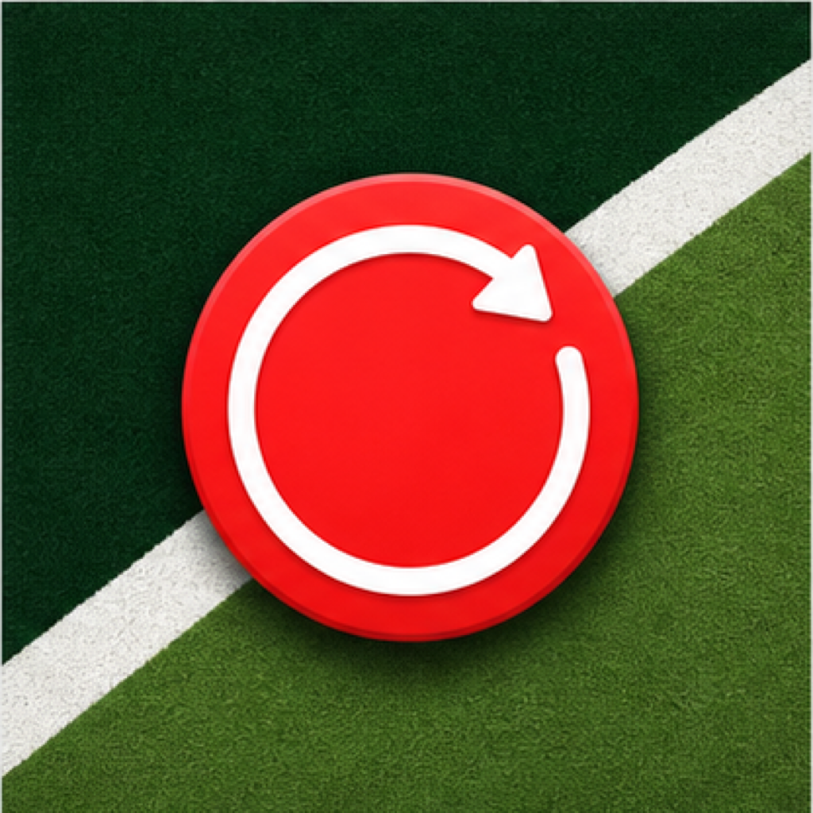
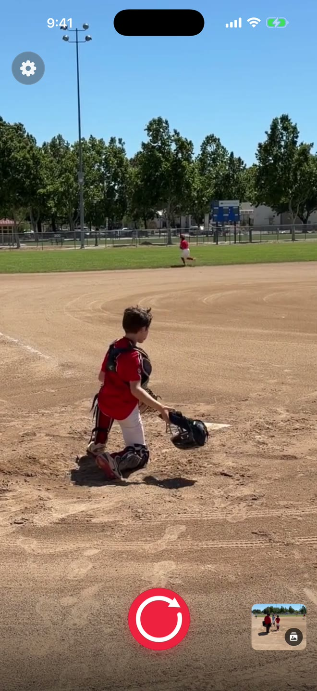
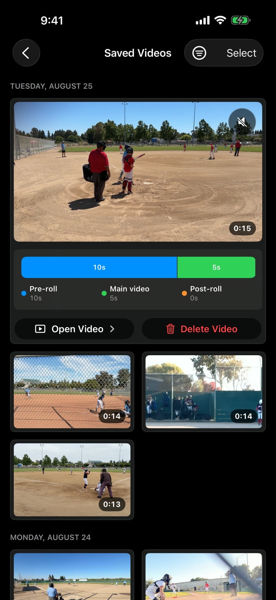

  

# Sideline Save

## A dash cam for youth sports

### Keep the highlights. Skip the two-hour recording.

Watch the game and save only the moment that mattered. Sideline Save keeps up
to 30 seconds ready, so after something great happens, tap Record and the app
goes back in time to get the beginning of the play.

  

Download free for iPhone · 15 saved videos included · iOS 17+ · No account or
ads

[Watch the 18-second app demo](https://sidelinesave.com/videos/sideline-save-app-preview.mp4)

[About](https://sidelinesave.com/) ·
[Baseball + Softball](https://sidelinesave.com/baseball-softball.html) ·
[Soccer](https://sidelinesave.com/soccer.html) ·
[Support](https://sidelinesave.com/support.html) ·
[Blog](https://sidelinesave.com/blog/) ·
[Equipment](https://sidelinesave.com/recommended-gimbals.html) ·
[Privacy](https://sidelinesave.com/privacy-policy.html)

## Why parents use Sideline Save

1. **Watch the game, not your screen.** Use a $5 bungee cord to mount your
   iPhone to a fence. Keep your hands free, stay present, and stop holding a
   phone in another parent’s view.
2. **Skip the storage and editing marathon.** A two-hour 4K/60 recording can use
   about 53 GB[^storage] and take about 15 minutes[^editing] to review and
   trim. Sideline Save saves you 98% of that storage and time.[^savings]
3. **Decide after it happens.** Sideline Save keeps a rolling window ready.
   Once you know the moment was special, tap Record to keep the lead-in, then
   tap again when the play is over.

[^storage]: Estimate: 440 MB per minute for 4K/60 HEVC × 120 minutes = 52,800
    MB, or about 53 GB.
[^editing]: Estimate for a focused highlight pass: about 10 minutes to skim at
    high speed, plus 5 minutes to select, trim, and export a few clips.
[^savings]: Illustrative estimate: about two minutes of highlights instead of
    120 minutes of footage, and roughly 18 seconds of total tap-to-save
    interaction instead of a 15-minute editing pass. Actual savings vary.

## Tap after the hit. The swing is already there.

The phone keeps a short rolling window without filling Photos. Tap Record after
the hit to keep the lead-in, then tap again when the play is over.

  
  

## Quick answers

### What sports does Sideline Save work with?

Every sport. Choose a built-in starting mode for Baseball, Basketball, Soccer,
or Football, or use Custom for anything else. Baseball works well for softball,
and Custom is a good starting point for volleyball.

### Will Sideline Save kill my battery?

Sideline Save does not use more battery than leaving the built-in Camera app
recording for the same amount of time. In our iPhone 17 Pro testing, budget
roughly 25% of a full charge for a two-hour game. For the best battery life,
lower the screen brightness and shade the phone from direct sunlight.

### Is the whole game being saved somewhere?

No. Like a dash cam or doorbell camera, Sideline Save keeps a temporary rolling
window. Only the moments you choose are finished and saved to Photos; closing
the app stops capture.

### How does the video compare with GameChanger?

GameChanger’s full-event video is limited to 720p, which can look soft when you
crop or zoom. Sideline Save records using your chosen iPhone camera quality, so
it can preserve much more detail. GameChanger only provides a full-event replay
when the event was live streamed, and non-staff viewers need Premium or a
Premium Team Pass. See
[GameChanger’s documentation](https://help.gc.com/hc/en-us/articles/360057075012-Full-Event-Videos).

## Your footage never goes to a Sideline Save cloud

Everything stays on your iPhone—Sideline Save never uploads your footage. There
are no accounts, ads, or cross-app tracking.

[Read the Privacy Policy](https://sidelinesave.com/privacy-policy.html)

## Independent and personal

### Built by a baseball dad with the same problem

Sideline Save is a handcrafted app made by one person. I built it after getting
tired of recording pitch after pitch at my son’s games, deleting nearly all of
them, and still worrying that the next pitch would be the one I missed.

[Read why I built Sideline Save](https://sidelinesave.com/blog/why-i-built-a-camera-app-for-youth-sports-parents.html)

© 2026 Chase Seibert. Sideline Save.
